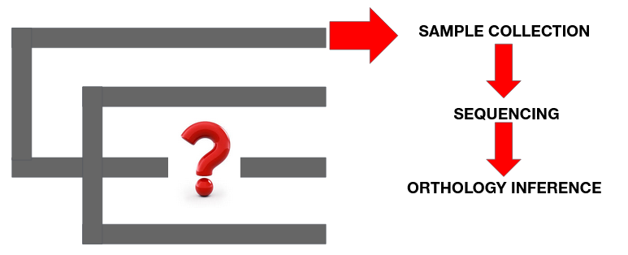
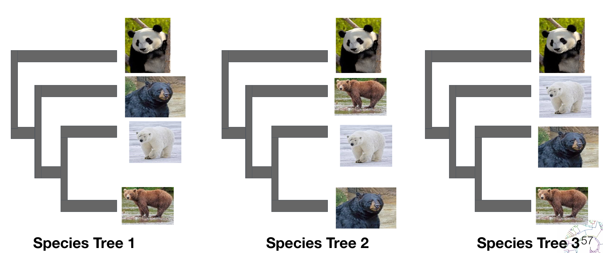

# MAXIMUM LIKELIHOOD

**Instructors**: Jesus Lozano-Fernandez & Mattia Giacomelli

If you have any questions, contact us at jesus.lozano@ub.edu or mattia.giacomelli@ub.edu

***
## Context

We will be working with an alignment composed by 50 orthologous genes concatenated from 8 bears, 2 individuals for each of the 4 species (panda, black bear, brown bear and polar bear).





***
## Data files

For Maximum likelihood tree reconstruction, we will use the software IQ-TREE which is already installed in the Docker.

All files for this hands-on class are in the folder **Bear_dataset_ML** provided in the github repository. We will use a separate folder for each analysis. All the folders already contain the results (output files), but we will overwrite them in the new analyses you will perform. If you are interested in comparing them with your results, you can download the folder again from the GitHub.

You can download the data executing the following command from your home directory:

```
ghget https://github.com/ppgcourseUB/ppgcourse2024_week1/tree/main/Maximum_Likelihood.JESUS_LOZANO
cd Maximum_Likelihood.JESUS_LOZANO/Bear_dataset_ML
```

***

# Model selection

First, we will find which is the best substitution model for our data using the model selection option from IQ-TREE. We will use a concatenated alignment of 50 genes belonging to those individuals.

1.- From the `Bear_dataset_ML` folder, go to the folder for model selection:

`cd model_selection`

If you take at look at the **`model_finder.sh`** file you can see the whole list of models that we are going to test:

`iqtree -s 50_genes.fa -m MF -mset LG+F+G,WAG+F+G,JTT+F+G -madd LG+C20+F+G,LG+C10+F+G,LG4X --score-diff all -nt 8 -redo`

We are including the four most common site-homogeneous models and almost all the mixture models available.

2.- For executing the analysis run:

`bash model_finder.sh`

3.- Check the 50_genes.fa.iqtree file.

>- **Which is the best model?**
>- **Which kind of model is it?**

You can take a look at the models in: http://www.iqtree.org/doc/Substitution-Models

***

# Bootstrap

Let’s test now the differences in the bootstrap value assignment methods to assess the support of nodes. We will first compare the execution time of 2 methods: ultrafast bootstrap and non-parametric bootstrap.

We will use the concatenated alignment and the model obtained as the best fitting from the previous exercise.

### Ultrafast bootstrap

1.- Go to the folder for ultrafast bootstrap:

`cd ../ultrafast_bootstrap`

2.- Modify the **`ultrafast_iqtree.sh`** script to include the best substitution model where it says **MODEL**.

`nano ultrafast_iqtree.sh`

`iqtree -s 50_genes.fa -m MODEL -bb 1000 -nt 8 -redo`

Once modified, you are ready to run the analysis:

`bash ultrafast_iqtree.sh`

More information on the ultrafast bootstrap in: http://www.iqtree.org/doc/Tutorial#assessing-branch-supports-with-ultrafast-bootstrap-approximation and http://www.iqtree.org/doc/Frequently-Asked-Questions#how-do-i-interpret-ultrafast-bootstrap-ufboot-support-values


### Non-parametric bootstrap

1.- Go to the folder for non-parametric bootstrap:

`cd ../non_parametric`

2.- Modify the **`non_parametric_iqtree.sh`** script to include the best substitution model where it says **MODEL**. For time constraints, we will just run 5 bootstrap replicates, but normally you will use 100 bootstrap replicates or more (modify with the **-b** command).

`iqtree -s 50_genes.fa -m MODEL -b 5 -nt 8 -redo`

For executing the analysis run:

`bash non_parametric_iqtree.sh`

More information on non-parametric bootstrap in: http://www.iqtree.org/doc/Tutorial#assessing-branch-supports-with--standard-nonparametric-bootstrap

***

Once finished (this may take a while), you can check the execution time in the **.log** files in each of the above folders. You can visualize the output trees in your preferred visualization software.

>- **Which bootstrap method is the slowest?**
>- **Which differences can you see in the bootstrap values?**

***

# Topology test

Another interesting feature of IQ-TREE are the tree toplogy tests. IQ-TREE can compute the log-likelihoods of some tree topologies. In this case, we will test which of the 3 topologies of the species tree is more probable given our dataset of 50 genes. Besides just comparing the log-likelihoods of different topologies, we will also test if we can significantly reject certain topologies (outputing p-values), such as KH, SH and AU tests.

 

More information here: http://www.iqtree.org/doc/Advanced-Tutorial#tree-topology-tests

IQ-TREE first reconstructs a ML tree and then computes the log-likelihood of the tree topologies based on the estimated parameters for the ML tree.

Parameters for the ML tree can be estimated in different ways, we will use 2 and we will compare them.

1.- First, let’s IQ-TREE reconstruct the tree **given the best model estimated before**.

Go to the folder:

`cd ../topology_test_model`

Modify the **`topology_test_model.sh`** script to include the best substitution model where it says **MODEL**. You can use any command-line tool you know (such as emacs or vim) or any text editor.

`iqtree -s 50_genes.fa -z ../bear_species_trees_topologies.tre -m MODEL -redo`

For executing the analysis run:

`bash topology_test_model.sh`

2.- In here, we will base the estimation on a **tree that we have reconstructed before**.

Go to the folder:

`cd ../topology_test_tree`

Modify the **`topology_test_using_tree.sh`** script to include a previously reconstructed tree where it says **PREVIOUS_TREE**.

`iqtree -s 50_genes.fa -z ../bear_species_trees_topologies.tre -te PREVIOUS_TREE -redo`

For executing the analysis run:

`bash topology_test_using_tree.sh`

>- **Which of the 3 topologies is more probable?**
>- **Does this result change with the different analyses?**

***
